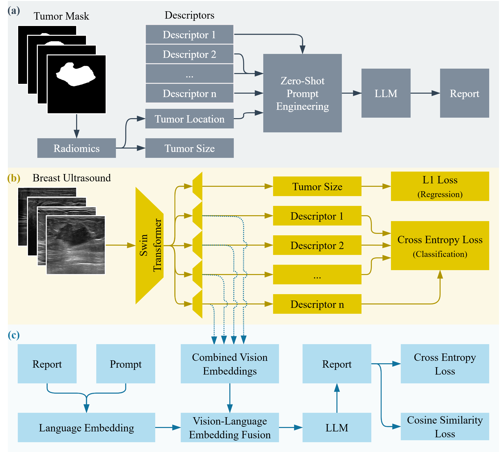

# BUSTR: BREAST ULTRASOUND TEXT REPORTING WITH A DESCRIPTOR-AWARE VISION–LANGUAGE MODEL
This repository will contain the code used in the paper once it's published ["BUSTR: BREAST ULTRASOUND TEXT REPORTING WITH A DESCRIPTOR-AWARE VISION–LANGUAGE MODEL"](https://doi.org/10.48550/arXiv.2511.20956).

#### BUSTR is a vision language model for breast ultrasound (BUS) report generation. It combines the following:

- BUSTR creates BUS reports from structured descriptors using Llama using zero-shot prompting.
- Training a multitask vision model for descriptor classification and tumor regression.
- A combined objective function to balance the multitask descriptor classification.
- A report generation pipeline that uses the pretrained vision model to produce radiology reports that align with the report generated by the zero-shot prompting.
- Two level of objective, CrossEntropy and Cosine similarity for the report generation pipeline.

## Architecture Diagram




## Quick Start

Clone the repository:
```bash
git clone https://github.com/AAR-UNLV/BUSTR
cd BUSTR
```
## Datasets used

### BrEaST
```
https://www.cancerimagingarchive.net/collection/breast-lesions-usg/
```

### BUS-BRA
```
https://www.kaggle.com/datasets/orvile/bus-bra-a-breast-ultrasound-dataset
```

## Pretrained models used

### 1. Llama 3.1

```
https://huggingface.co/meta-llama/Llama-3.1-8B-Instruct
```
### 2. Llama 2

```
https://huggingface.co/meta-llama/Llama-2-7b-chat
```

### 3. Swin Transformer

```
https://huggingface.co/microsoft/swin-base-patch4-window7-224
```

## Citation
```
Mohammed, Rawa, Mina Attin, and Bryar Shareef. "BUSTR: Breast Ultrasound Text Reporting with a Descriptor-Aware Vision-Language Model." arXiv preprint arXiv:2511.20956 (2025).
```


